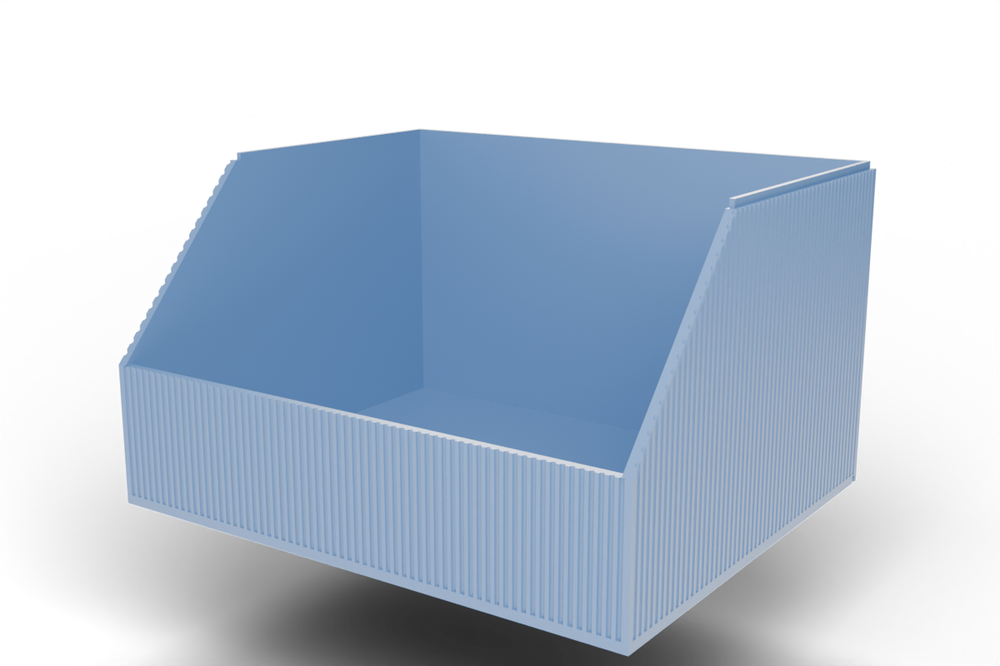
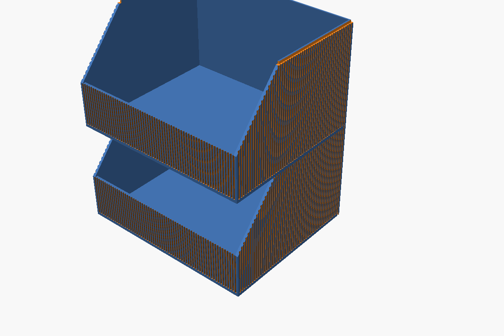

# Parametric Open-Front Storage Bin (OpenSCAD)

A fully parametric, open-front storage bin with a low front wall and a diagonal chamfer on the side walls. Designed in [OpenSCAD](https://openscad.org/) and compatible with the **MakerWorld Parametric Maker** so you can resize it directly in the browser without installing anything.

Originally designed to organise the technical compartments of a HYMER Grand Canyon S camper, but useful anywhere you need a tidy, drop-in bin: drawers, shelves, vans, workshops, kitchens.



## Print profile on MakerWorld

Ready-to-print profiles (with sliced settings) are published on MakerWorld:

**➡️ [Parametrischer offener Aufbewahrungsbehälter on MakerWorld](https://makerworld.com/de/models/2867878-parametric-open-front-storage-bin#profileId-3204005)**

You can also customise the dimensions directly on MakerWorld via the Parametric Maker — no local OpenSCAD installation required.

## Features

- Fully parametric: width, depth, height, front-wall height, chamfer length, wall and floor thickness
- Diagonal chamfer on the side walls for easy access to contents
- **Optional stacking interface** — inner lip on top mates with a recess on the bottom, so bins stack securely without sacrificing any interior volume
- **Optional relief texture** — vertical grooves on the outer walls in three styles (rectangular, V-groove, rounded), symmetrically distributed with configurable corner margin
- Optional bottom-edge chamfer to relieve elephant-foot artefacts
- Printer presets for Bambu Lab **P1S**, **P2S**, **H2C**, **H2D** (auto-clamps dimensions to the build volume) plus a **Custom** option
- Single STL — prints flat on the build plate, no supports required



## Parameters

All parameters are exposed via the OpenSCAD Customizer (and the MakerWorld Parametric Maker):

| Section | Parameter | Description |
|---|---|---|
| Printer / Build Volume | `printer` | Preset: `P1S`, `P2S`, `H2C`, `H2D`, or `Custom` |
| Printer / Build Volume | `max_build_x/y/z` | Custom build volume (used only when `printer = "Custom"`) |
| Outer Dimensions | `width`, `depth`, `height` | Outer size in mm (auto-capped to build volume) |
| Front Opening | `front_height` | Height of the short front wall |
| Front Opening | `chamfer_len` | Length of the diagonal chamfer along the side walls (0 = vertical step) |
| Walls | `wall`, `floor_t` | Wall and floor thickness |
| Stacking | `stackable` | Off (default) or On — adds a lip on top + recess on bottom so bins stack |
| Stacking | `stack_lip_h` | Height of the lip / depth of the recess (mm, default 3.0) |
| Stacking | `stack_clearance` | Horizontal fit clearance per side (mm, default 0.2) |
| Cosmetic | `bottom_chamfer` | Outer bottom-edge chamfer for elephant-foot relief |
| Relief / Texture | `relief_enabled` | Off (default) or On — adds vertical grooves on outer walls |
| Relief / Texture | `relief_style` | Groove shape: `Rectangular`, `V-groove`, or `Rounded` (default) |
| Relief / Texture | `relief_count` | Approximate total number of grooves around the full perimeter (default 240) |
| Relief / Texture | `relief_depth` | Groove depth into wall surface in mm (default 0.6) |
| Relief / Texture | `relief_width` | Groove width in mm (default 1.0) |
| Relief / Texture | `relief_corner` | Min. solid wall at each corner in mm (default 1.0) |
| Relief / Texture | `relief_walls` | Which walls: `All walls`, `Sides only`, or `Front+Back only` |
| Quality | `$fn` | Render smoothness |

Geometric inputs are clamped internally, so any combination of slider values produces a valid model.

### Stacking — how it works

Set `stackable = On` to make a bin stack with other identical-footprint bins. The geometry adds:

- A **lip** on the top of the back wall and the rear half of both side walls. The lip uses the **inner half** of the wall thickness, so the bin's outer footprint stays flat from the outside.
- A matching **U-shaped recess** in the underside of the floor (back + rear-sides).

When you stack two bins, the lip of the lower bin slots into the recess of the upper bin. **No interior storage volume is lost** — only ~`stack_lip_h` (default 3 mm) is "consumed" from the total stack height.

Notes:

- The open front means there is no lip across the front of the bin, only on the back and rear-side sections — but that's plenty for lateral stability.
- For tall narrow bins or heavy contents, consider increasing `wall` to 2.4–3.0 mm so the half-thickness lip stays rigid.
- All stacked bins must have the same `width`, `depth`, `wall`, and `stack_lip_h` for the fit to work.

### Relief / Texture — how it works

Set `relief_enabled = On` to add vertical grooves on the outer wall surfaces for a decorative ribbed look.

Three groove shapes are available:

- **Rectangular** — flat-bottom channel, sharpest shadow lines, best grip
- **V-groove** — triangular notch, crisp light/shadow effect
- **Rounded** — semicircular channel, smooth premium look (default)

Grooves are distributed **symmetrically per wall** — the spacing is derived from the total perimeter count, then rounded per wall so no groove ever falls on a corner edge. The `relief_corner` parameter guarantees a minimum solid margin at every corner for structural integrity and clean printing.

> **Print note:** Groove depth is automatically clamped to leave at least 0.4 mm of wall thickness.
> All groove shapes print cleanly on FDM at 0.2 mm layer height without supports.

## Installing OpenSCAD

1. Download OpenSCAD for your platform from <https://openscad.org/downloads.html>
   - **Windows**: MSI or portable ZIP
   - **macOS**: DMG (Apple Silicon and Intel builds available)
   - **Linux**: AppImage, Snap, Flatpak, or your distro's package manager
2. Install and launch OpenSCAD.
3. Recommended: use the latest **development snapshot** — it ships a much improved Customizer and faster preview than the 2021 stable build.

## Using this model

1. Clone or download this repository:

   ```bash
   git clone https://github.com/BetaHydri/openscad-parametric-storage-bin.git
   ```

2. Open `storage-bin.scad` in OpenSCAD.
3. Open the **Customizer** panel (`Window → Customizer`) and adjust the parameters.
4. Press **F5** for a quick preview, **F6** for a full render.
5. Export the mesh: `File → Export → Export as STL…` (or `.3MF`).

## Printing

Recommended slicer settings (tested on Bambu Lab H2D with Bambu PLA Basic):

- **Layer height**: 0.20 mm
- **Walls / perimeters**: 3
- **Top / bottom layers**: 4
- **Infill**: 15 % gyroid (more if you need extra rigidity)
- **Supports**: none — the geometry is self-supporting
- **Brim**: optional; only needed for very tall/narrow bins
- **Orientation**: print flat on the build plate (floor down)

For a ready-to-print `.3mf` with profile-tuned settings, use the [MakerWorld print profile](https://makerworld.com/de/models/2867878-parametric-open-front-storage-bin#profileId-3204005).

### Bambu Studio project files

The [`print-profiles/`](print-profiles/) folder contains Bambu Studio `.3mf` project files for concrete fitments used in a HYMER Grand Canyon S camper — open them directly in Bambu Studio, re-slice if needed, and print. See [`print-profiles/README.md`](print-profiles/README.md) for details.

## License

Released under the [MIT License](LICENSE). Attribution is appreciated but not required.

## Contributing

Issues and pull requests are welcome — especially:

- Additional printer presets
- Cosmetic variants (rounded corners, dividers, label slot, magnet pockets)
- Improvements to the Customizer parameter ranges
